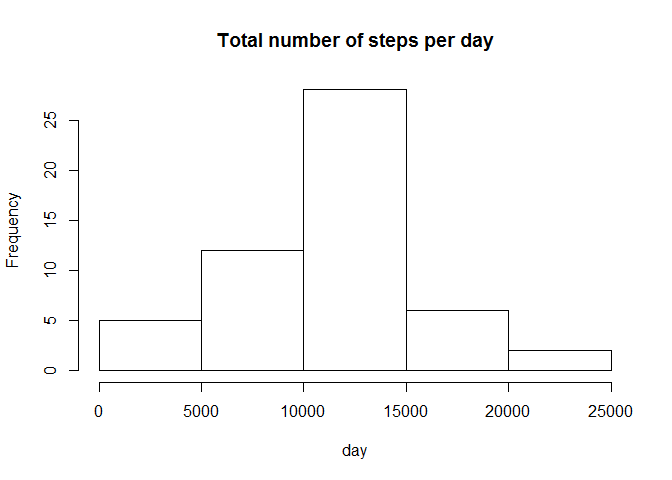
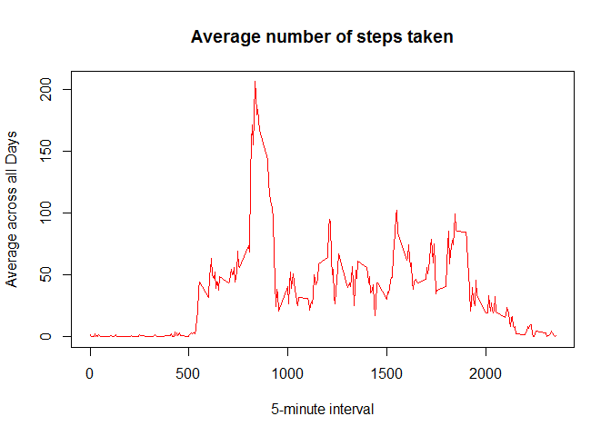
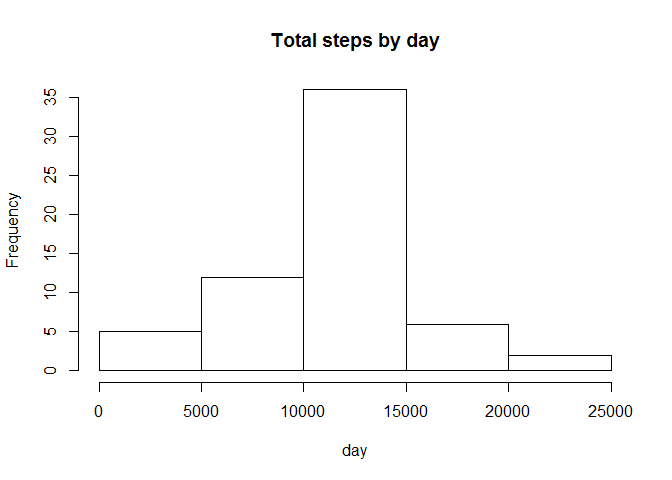

# Reproducible Research: Peer Assessment 1

## Loading and preprocessing the data


```r
#Create data folder
if(!file.exists("./data")){dir.create("./data")}

#zip url
zipURL<-"https://d396qusza40orc.cloudfront.net/repdata%2Fdata%2Factivity.zip"
destFile ="./data/Dataset.zip"
download.file(zipURL,destFile)

#Unzip the data file
unzip(destFile,exdir="./data")

#source file
dataSource<-"./data/activity.csv"

#load data
dateFeed <- read.csv(dataSource, colClasses = c("numeric", "character", 
    "numeric"))

#convert from char to date for easier process
dateFeed$date <- as.Date(as.character(dateFeed$date))

summary(dateFeed)
```

```
##      steps             date               interval     
##  Min.   :  0.00   Min.   :2012-10-01   Min.   :   0.0  
##  1st Qu.:  0.00   1st Qu.:2012-10-16   1st Qu.: 588.8  
##  Median :  0.00   Median :2012-10-31   Median :1177.5  
##  Mean   : 37.38   Mean   :2012-10-31   Mean   :1177.5  
##  3rd Qu.: 12.00   3rd Qu.:2012-11-15   3rd Qu.:1766.2  
##  Max.   :806.00   Max.   :2012-11-30   Max.   :2355.0  
##  NA's   :2304
```

## What is mean total number of steps taken per day?


```r
#1- Calculate the total number of steps taken per day
TotalSteps <- aggregate(steps ~ date, data = dateFeed, sum, na.rm = TRUE)

#2- Make a histogram of the total number of steps taken each day
hist(TotalSteps$steps, main = "Total number of steps per day", xlab = "day")
```

<!-- -->

```r
#3.a- Calculate and report the mean of the total number of steps taken per day
mean(TotalSteps$steps)
```

```
## [1] 10766.19
```

```r
#3.b- Calculate and report the median of the total number of steps taken per day
median(TotalSteps$steps)
```

```
## [1] 10765
```

## What is the average daily activity pattern?


```r
#1- Make a time series plot (i.e. type = "l") of the 5-minute interval (x-axis) and the average number of steps taken, averaged across all days (y-axis)
time_series <- tapply(dateFeed$steps, dateFeed$interval, mean, na.rm = TRUE)
plot(row.names(time_series), time_series, type = "l", xlab = "5-minute interval", 
    ylab = "Average across all Days", main = "Average number of steps taken", 
    col = "red")
```

<!-- -->

```r
#2- Which 5-minute interval, on average across all the days in the dataset, contains the maximum number of steps?
max_interval <- which.max(time_series)
names(max_interval)
```

```
## [1] "835"
```

## Imputing missing values


```r
#1- Calculate and report the total number of missing values in the dataset (i.e. the total number of rows with NAs)
dateFeed_NA <- sum(is.na(dateFeed))
dateFeed_NA
```

```
## [1] 2304
```

```r
#2- Devise a strategy for filling in all of the missing values in the dataset. The strategy does not need to be sophisticated. For example, you could use the mean/median for that day, or the mean for that 5-minute interval, etc.
StepsAverage <- aggregate(steps ~ interval, data = dateFeed, FUN = mean)
fillNA <- numeric()
for (i in 1:nrow(dateFeed)) {
    obs <- dateFeed[i, ]
    if (is.na(obs$steps)) {
        steps <- subset(StepsAverage, interval == obs$interval)$steps
    } else {
        steps <- obs$steps
    }
    fillNA <- c(fillNA, steps)
}

#3- Create a new dataset that is equal to the original dataset but with the missing data filled in.
new_dateFeed <- dateFeed
new_dateFeed$steps <- fillNA

#4- Make a histogram of the total number of steps taken each day and Calculate and report the mean and median total number of steps taken per day. Do these values differ from the estimates from the first part of the assignment? What is the impact of imputing missing data on the estimates of the total daily number of steps?
StepsTotal <- aggregate(steps ~ date, data = new_dateFeed, sum, na.rm = TRUE)
hist(StepsTotal$steps, main = "Total steps by day", xlab = "day")
```

<!-- -->

```r
mean(StepsTotal$steps)
```

```
## [1] 10766.19
```

```r
median(StepsTotal$steps)
```

```
## [1] 10766.19
```

## Are there differences in activity patterns between weekdays and weekends?


```r
#1- Create a new factor variable in the dataset with two levels - "weekday" and "weekend" indicating whether a given date is a weekday or weekend day.
day <- weekdays(dateFeed$date)
daylevel <- vector()
for (i in 1:nrow(dateFeed)) {
    if (day[i] == "Saturday") {
        daylevel[i] <- "Weekend"
    } else if (day[i] == "Sunday") {
        daylevel[i] <- "Weekend"
    } else {
        daylevel[i] <- "Weekday"
    }
}
dateFeed$daylevel <- daylevel
dateFeed$daylevel <- factor(dateFeed$daylevel)

stepsByDay <- aggregate(steps ~ interval + daylevel, data = dateFeed, mean)
names(stepsByDay) <- c("interval", "daylevel", "steps")


#2- Make a panel plot containing a time series plot (i.e. type = "l") of the 5-minute interval (x-axis) and the average number of steps taken, averaged across all weekday days or weekend days (y-axis). See the README file in the GitHub repository to see an example of what this plot should look like using simulated data.
library(lattice)
xyplot(steps ~ interval | daylevel, stepsByDay, type = "l", layout = c(1, 2), 
    xlab = "Interval", ylab = "Number of steps")
```

<!-- -->
